# 자동차 매출 데이터 분석

> sql을 활용한 자동차 데이터 분석


### 데이터 생성

##### 데이터 다운로드

http://www.mysqltutorial.org/mysql-sample-database.aspx

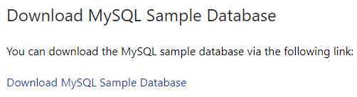

##### 데이터 생성

- MySQL Workbench에서 다운받은 파일 실행
- 쿼리를 실행한 후 새로 고침

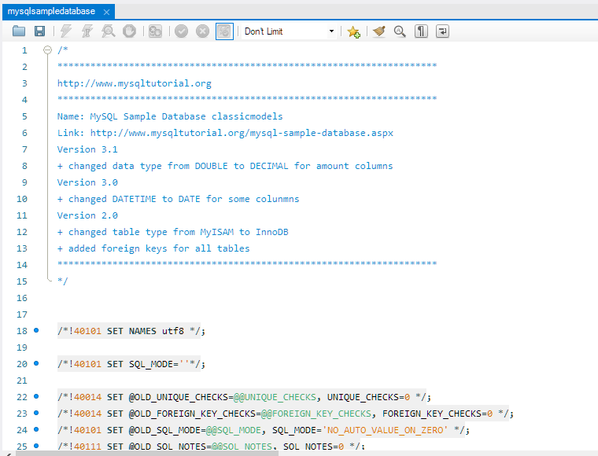

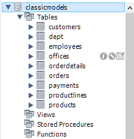


##### ERD 생성

- [Database] - [Reverse Engineer...] 실행

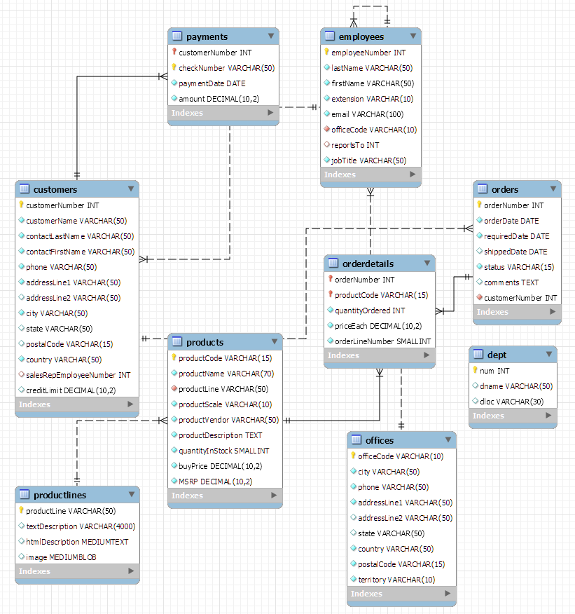

### 구매 지표 추출

##### 매출액 조회

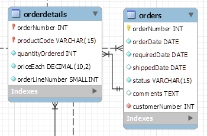

- 일별
  - orders 테이블에서 주문일자(orderDate)와 orderdetails 테이블에서 판매액(priceEach * quantityOrdered) 조회
  - 두 테이블이 필요하므로 테이블을 공통 값인 orderNumber로 `LEFT JOIN`
  - 날짜가 중복되는 경우 값을 더해줌

```sql
SELECT A.orderDate, sum(priceEach*quantityOrdered) as Sales
FROM classicmodels.orders A
LEFT JOIN classicmodels.orderdetails B
ON A.orderNumber = B.orderNumber
GROUP BY orderDate;
```

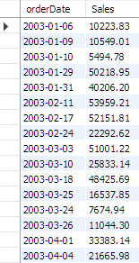

- 월별

  - orderDate 값이 '2003-01-06' 형식으로 되어있으므로 앞의 7자리 가져오기

  ```sql
  SELECT substr(A.orderDate,1,7)
  FROM classicmodels.orders A;
  ```

  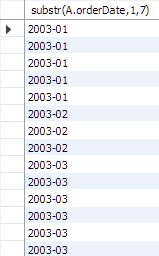

  - 일별 매출액을 구한 방식으로 월별 매출액 구하기

  ```sql
  SELECT substr(A.orderDate,1,7) as Month_data, sum(priceEach*quantityOrdered) as Sales
  FROM classicmodels.orders A
  LEFT JOIN classicmodels.orderdetails B
  ON A.orderNumber = B.orderNumber
  GROUP BY substr(A.orderDate,1,7);
  ```

  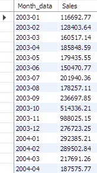

- 연도별

  - orderDate 값이 '2003-01-06' 형식으로 되어있으므로 앞의 4자리 가져오기

  ```sql
  SELECT substr(A.orderDate,1,4)
  FROM classicmodels.orders A;
  ```

  - 일별 매출액을 구한 방식으로 연도별 매출액 구하기

  ```sql
  SELECT substr(A.orderDate,1,4) as Month_data, sum(priceEach*quantityOrdered) as Sales
  FROM classicmodels.orders A
  LEFT JOIN classicmodels.orderdetails B
  ON A.orderNumber = B.orderNumber
  GROUP BY substr(A.orderDate,1,4);
  ```

  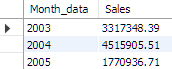

##### 구매자 수와 구매 건수 조회

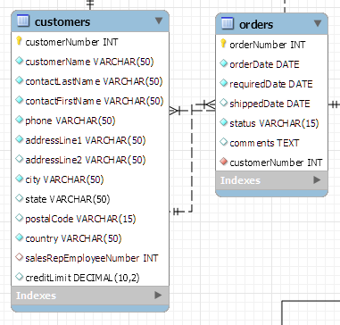

- 일별
  - customers 테이블에서 고객 번호(customerNumber)와 orders 테이블에서 판매 번호(orderNumber) 조회
  - 고객 번호가 중복되면 오류가 발생할 수 있으므로 `distinct`를 사용하여 중복 제거

  ```sql
  SELECT orderDate, count(distinct customerNumber) as customer_orders, count(orderNumber) as orders_total
  FROM classicmodels.orders
  GROUP BY 1;
  ```

  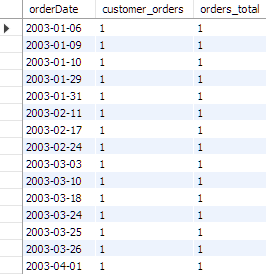

- 월별

  - orderDate 값이 '2003-01-06' 형식으로 되어있으므로 앞의 7자리 가져오기
  - 일별 구매자 수와 구매 건수를 구한 방식으로 월별 구매자 수와 구매 건수 구하기

  ```sql
  SELECT substr(orderDate,1,7), count(distinct customerNumber) as customer_orders, count(orderNumber) as orders_total
  FROM classicmodels.orders
  GROUP BY 1;
  ```

  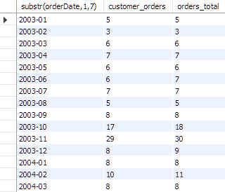

- 연도별
  - orderDate 값이 '2003-01-06' 형식으로 되어있으므로 앞의 4자리 가져오기
  - 연도별 구매자 수와 구매 건수를 구한 방식으로 연도별 구매자 수와 구매 건수 구하기

```sql
SELECT substr(orderDate,1,4), count(distinct customerNumber) as customer_orders, count(orderNumber) as orders_total
FROM classicmodels.orders
GROUP BY 1;
```

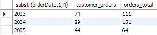


##### 인당 평균 매출액 조회

- 월별

  - 월별 매출액과 구매자 수를 구하고 그 두 개의 값을 나눠줌

  ```sql
  SELECT substr(A.orderDate,1,7) as MM, count(distinct customerNumber) as customer_orders, sum(priceEach*quantityOrdered) as Sales, 
  sum(priceEach*quantityOrdered)/count(distinct customerNumber) as AMV
  FROM classicmodels.orders A
  LEFT JOIN classicmodels.orderdetails B
  ON A.orderNumber = B.orderNumber
  GROUP BY 1;
  ```

  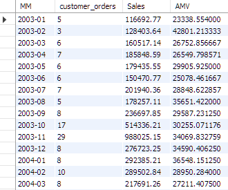

- 연도별

  - 연도별 매출액과 구매자 수를 구하고 그 두 개의 값을 나눠줌

  ```sql
  SELECT substr(A.orderDate,1,4) as YY, count(distinct customerNumber) as customer_orders, sum(priceEach*quantityOrdered) as Sales, 
  sum(priceEach*quantityOrdered)/count(distinct customerNumber) as AMV
  FROM classicmodels.orders A
  LEFT JOIN classicmodels.orderdetails B
  ON A.orderNumber = B.orderNumber
  GROUP BY 1;
  ```

  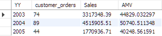


##### 건당 구매 금액 조회

- 월별

  - 연도별 매출액과 구매 건수를 구하고 그 두 개의 값을 나눠줌

  ```sql
  SELECT substr(A.orderDate,1,7) as MM,count(distinct A.orderNumber) as orders_total, sum(priceEach*quantityOrdered) as Sales, 
  sum(priceEach*quantityOrdered)/count(distinct A.orderNumber) as ATV
  FROM classicmodels.orders A
  LEFT JOIN classicmodels.orderdetails B
  ON A.orderNumber = B.orderNumber
  GROUP BY 1;
  ```

  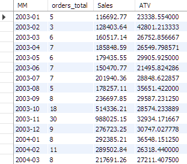

- 연도별

  - 연도별 매출액과 구매 건수를 구하고 그 두 개의 값을 나눠줌

  ```sql
  SELECT substr(A.orderDate,1,4) as YY,count(distinct A.orderNumber) as orders_total, sum(priceEach*quantityOrdered) as Sales, 
  sum(priceEach*quantityOrdered)/count(distinct A.orderNumber) as ATV
  FROM classicmodels.orders A
  LEFT JOIN classicmodels.orderdetails B
  ON A.orderNumber = B.orderNumber
  GROUP BY 1;
  ```

  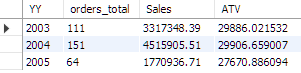


### 그룹별 구매 지표 추출

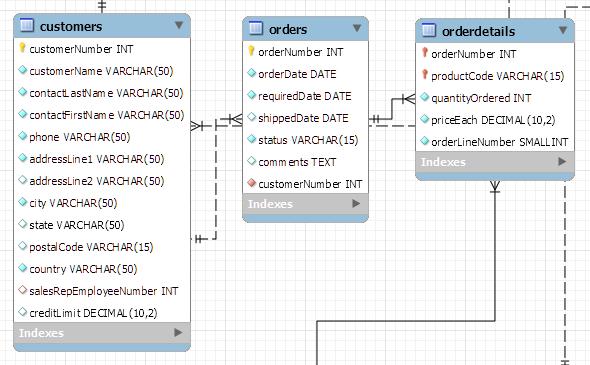

##### 국가별, 도시별 매출액

- orders, orderdetails 테이블에서 주문 번호(orderNumber)와 orders, customers 테이블에서 customerNumber 필드 연결
- 필요한 데이터인 country, city, priceEach*quantityOrdered만 추출
- country와 city로 그룹핑하고 정렬해줌

```sql
SELECT C.country, C.city, sum(priceEach*quantityOrdered) as Sales
FROM classicmodels.orders A
LEFT JOIN classicmodels.orderdetails B
ON A.orderNumber = B.orderNumber
LEFT JOIN classicmodels.customers C
ON A.customerNumber = C.customerNumber
GROUP BY 1, 2
ORDER BY 1, 2;
```

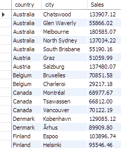


##### 북미 vs 비북미 매출액 비교

- `CASE WHEN 조건 THEN 결과 END` 구문 사용
  - country가 'USA' 또는 'Canada'이면 'North America'로 출력하고, 그렇지 않은 경우는 Others로 출력
  - country_grp로 그룹핑하고 Sales를 기준으로 내림차순 정렬

```sql
SELECT CASE WHEN country IN ('USA', 'Canada') 
	   THEN 'North America'
       ELSE 'Others' 
       END country_grp, 
	   sum(priceEach*quantityOrdered) as Sales
FROM classicmodels.orders A
LEFT JOIN classicmodels.orderdetails B
ON A.orderNumber = B.orderNumber
LEFT JOIN classicmodels.customers C
ON A.customerNumber = C.customerNumber
GROUP BY 1
ORDER BY 2 DESC;
```

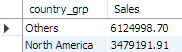


##### 국가별 매출 순위 매기기

- `DENSE_RANK() `: 동률을 같은 등수로 처리하지만 ,그 다음 등수를 동률의 수 만큼 제외하지 않고 바로 다음 등수로 매김

```sql
SELECT C.country, sum(priceEach*quantityOrdered) as Sales,
DENSE_RANK() OVER(ORDER BY sum(priceEach*quantityOrdered) DESC) RNK
FROM classicmodels.orders A
LEFT JOIN classicmodels.orderdetails B
ON A.orderNumber = B.orderNumber
LEFT JOIN classicmodels.customers C
ON A.customerNumber = C.customerNumber
GROUP BY 1;
```

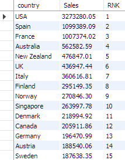


##### 재구매율

